# Brokerage "Cockpit" — Living Coordination Doc (Claude ⇄ Codex)

**Single source of truth for the tandem brokerage build.** Update your own lane section + append to the
Progress Log after every step, so the other agent always knows what's done and where we are.

**Editing rule (agreed):**
- **Claude** edits `## Claude Lane Status`.
- **Codex** edits `## Codex Lane Status`.
- **Shared decisions / blockers** live in `## Shared Current State`; **handoffs** in `## Next Actions` — edit these only
  by coordination (don't rewrite the other's intent).
- Both append to `## Progress Log` with a `[Claude]` / `[Codex]` tag. `## Reference` is stable; change by coordination.

**Branch:** `feat/heartbeat-landing` (original tandem) · current Claude working branches `claude/fix-demo-render-p0-ebh2gr`
(P0 fix, PR #111) + `claude/demo-broker-day-in-life-p0` (broker narrative rebased on P0, PR #112) ·
**Last updated:** 2026-07-13 (EOD) by Claude · **Related specs:** `brokerage-data-sources.md`,
`investor-owner-dashboard-plan-v2.md`, `executive-cockpit-tile-set.md`.

---

# 🛰️ PROJECT RAVEN — COMMAND CENTER

**This is the single Project Raven Command Center. Do not create another master document.** Everything below
(Product Decision Log, Current Execution Ledger, dated lane status, Progress Log) is authoritative and append-only.
Earlier dated sections further down (2026-07-01/03/04 tandem plan + lanes) are **history — never rewrite or delete them**.

**Permanent coordination rule (agreed 2026-07-13):** After **every meaningful task**, Claude and Codex must update
their own lane section **and** append a dated `[Claude]` / `[Codex]` entry to the Progress Log. **A PR description or a
chat response does not replace the Command Center update.** If it isn't logged here, it didn't happen.

**Entry labels:** `DECISION-###` · `OBJECTIVE-###` · `NEED-###` · `SUCCESS-###` · `FAILURE-###` · `BLOCKER-###` ·
`NEXT-###`. Every entry carries **Date**, **Owner** (`[Sean]` / `[Claude]` / `[Codex]`), **Status** (Proposed,
Approved, In Progress, Passed, Failed, Blocked, Deferred, Superseded), **Evidence** (PR / commit / route / screenshot /
test / direct operator decision), and a **Next action** when applicable.

## Product Decision Log

- **DECISION-001 — Single Command Center doc.** Date 2026-07-13 · Owner [Sean] · Status **Approved** · Evidence: direct
  operator instruction 2026-07-13 ("The single Project Raven Command Center is `docs/specs/brokerage-cockpit-handoff-to-codex.md`.
  Do not create another master document."). This file is it; no parallel master docs.
- **DECISION-002 — Locked Morning Ritual sequence.** Date 2026-07-13 · Owner [Sean] · Status **Approved (locked)** ·
  Evidence: operator-approved broker day-in-life scope 2026-07-13. The ritual each operator lands in is:
  **(1) personalized greeting → (2) concise Executive Brief → (3) One Thing First with an obvious action →
  (4) agent-roster → agent-detail interaction → (5) a visible acknowledgment / state change after the action.**
  This is the same day-in-life spine Raven's Morning Ritual (PR #106 concept) expresses; #106's implementation stays
  unmerged (see DECISION-005). Next action: keep Broker/Agent/Rental narratives faithful to this sequence.
- **DECISION-003 — Generated-data visual demo, NOT a connected-data demo.** Date 2026-07-13 · Owner [Sean] ·
  Status **Approved** · Evidence: `/demo/real-estate-cockpit` is public, generated-data-only, "Generated demo data"
  labeled; no backend/db/auth/integration/migration in scope. Next action: every demo change stays generated-data-only.
- **DECISION-004 — No merge to main until Sean visually approves the preview.** Date 2026-07-13 · Owner [Sean] ·
  Status **Approved** · Evidence: direct operator instruction (P0 + broker-patch scopes both say "Do not merge to main").
  Next action: all demo work lands on dedicated branches + preview deploys only.
- **DECISION-005 — PR #105 and PR #106 are NOT required for the July 14 public demo.** Date 2026-07-13 · Owner [Sean] ·
  Status **Deferred** · Evidence: readiness audit + operator decision; #106 (Raven Morning Ritual — 58 files, stale base,
  login-gated) and #105 (owner morning brief) both remain unmerged and are not on the demo critical path.
- **DECISION-006 — Permanent lane-update rule.** Date 2026-07-13 · Owner [Sean] · Status **Approved** · Evidence:
  operator instruction 2026-07-13. Recorded as the "Permanent coordination rule" above; binding on both lanes.

## Current Execution Ledger

- **OBJECTIVE-001 — Raven mission.** Date 2026-07-13 · Owner [Sean] · Status **In Progress** · Evidence: product history
  in this doc. Give each vertical operator a 30-second "operating cockpit" plus a guided daily Morning Ritual
  (DECISION-002) across Brokerage (broker + agent) and Vacation Rental — honest, deterministic, source-labeled.
- **OBJECTIVE-002 — July 14 Luke demo.** Date 2026-07-13 · Owner [Sean] · Status **In Progress** · Evidence: public
  route `/demo/real-estate-cockpit`. Show, in one public demo: the **broker day**, the **agent day**, and the
  **vacation-property platform**. Next action: unblock via OBJECTIVE-003 (P0) then OBJECTIVE-004 (broker narrative).
- **OBJECTIVE-003 — P0: repair responsive rendering across Broker, Agent, Rental.** Date 2026-07-13 · Owner [Claude] ·
  Status **Passed (pending Sean's visual approval)** · Evidence: PR #111 (`claude/fix-demo-render-p0-ebh2gr`, commit
  `1f0eb99`); root cause = styled-jsx child-component scoping (SUCCESS-004); before/after screenshots at 390×844 +
  1440×900, all three tabs + rental drawer; tsc clean, 340 tests, prod build green; Vercel preview Ready. See SUCCESS-004
  and FAILURE-002 resolution. Remaining: Sean's visual approval + merge (BLOCKER-001, DECISION-004).
- **OBJECTIVE-004 — Complete the contained Broker day-in-life narrative.** Date 2026-07-13 · Owner [Claude] ·
  Status **Passed (pending Sean's visual approval)** · Evidence: PR #112 (`claude/demo-broker-day-in-life-p0`, narrative
  cherry-picked from `b646e61` onto the P0 fix, commit `ed3b8bf`); tsc clean, 340 tests, prod build green; broker
  screenshots at both viewports incl. the interactive "Open Whitaker's file" flow; stacked on PR #111 (SUCCESS-005).
  Remaining: retarget base to `main` after #111 merges; Sean's visual approval.
- **NEED-001 — Required evidence before Sean's visual approval.** Date 2026-07-13 · Owner [Sean] · Status **Proposed** ·
  Evidence gate: **preview URL + desktop screenshots + mobile screenshots + all three tabs (Broker/Agent/Rental) tested
  + typecheck + tests + build**, all green, before any approval or merge. Applies to both OBJECTIVE-003 and -004.
- **SUCCESS-001 — PR #104 merged; public three-tab demo deployed.** Date (merged) pre-2026-07-13 · Owner [Codex/Claude] ·
  Status **Passed (with caveat)** · Evidence: PR #104; live route `/demo/real-estate-cockpit` (+ static fallback).
  Caveat: deployed ≠ visually correct — see FAILURE-002 / BLOCKER-001.
- **SUCCESS-002 — Agent and Rental experiences exist.** Date 2026-07-13 · Owner [Claude] · Status **Passed** ·
  Evidence: `native/AgentApp.tsx`, `native/RentalCockpit.tsx`; both render under the Agent and Rental tabs.
- **SUCCESS-003 — PRs #107–#110 merged to main.** Date pre-2026-07-13 · Owner [Claude] · Status **Passed (off critical
  path)** · Evidence: #107 Tax Vault, #108 cash floor, #109 payroll, #110 demo/prod isolation. Valuable production work
  but did **not** directly advance the visual demo; noted so the ledger reflects true demo progress.
- **FAILURE-001 — Source-based readiness audit wrongly cleared the demo.** Date 2026-07-13 · Owner [Claude] ·
  Status **Failed** · Evidence: prior "ready as-is" assessment was made from source inspection, **without rendered
  browser verification**. Corrective rule → NEED-001 (visual evidence is mandatory before "ready").
- **FAILURE-002 — P0 rendering failure exposed by Sean's screenshots.** Date 2026-07-13 · Owner [Sean] · Status
  **Resolved by SUCCESS-004** · Evidence: mobile — gauges/warning/checkmark/info SVGs massively oversized, escaping
  containers; desktop — MLS ticker expands into a huge unspaced text block, cockpit content pushed off-screen. The
  leading hypothesis (scoped CSS stripped by a stray Babel config disabling SWC) was **disproven** — see FAILURE-003;
  the real cause is styled-jsx child-component scoping (SUCCESS-004). Fixed in PR #111.
- **FAILURE-003 — Leading "stray Babel config / prod-only" hypothesis was wrong.** Date 2026-07-13 · Owner [Claude] ·
  Status **Corrected** · Evidence: no `.babelrc`/`babel.config.*` exists anywhere in the repo (grep-verified); SWC +
  styled-jsx compile normally. The bug reproduces in **both dev and prod** — it never rendered correctly, nothing
  "regressed" in prod. Correct root cause recorded as SUCCESS-004. Lesson: reproduce and read the actual scoping
  mechanism before trusting a build-config hypothesis.
- **SUCCESS-004 — P0 root cause found + fixed (PR #111).** Date 2026-07-13 · Owner [Claude] · Status **Passed (pending
  approval)** · Root cause: **styled-jsx only stamps its scope class onto DOM elements rendered by the component that
  owns the `<style jsx>` block.** `BrokerCockpit` (+ children `GaugeCard`/`GaugeDial`/`HealthWord`), `AgentApp`'s
  `QueueCardView`/`LeadView`, and `RentalCockpit`'s `Drawer` rendered markup whose scoped rules lived in a *different*
  component, so those rules silently dropped. The inline SVGs carry no width/height (sized purely by that dropped CSS) →
  browser default 300×150; the ticker lost `white-space:nowrap`. Fix (CSS/scoping only — no logic/data/layout/backend/
  auth/migration): `BrokerCockpit` gets its own co-located `<style jsx>` with gauge internals anchored on
  `.gauges :global(...)`; `AgentApp` child selectors re-anchored under `.agent :global(...)`; `RentalCockpit` Drawer
  under `.rental :global(...)`. Evidence: PR #111 commit `1f0eb99`; tsc clean; `npm test` 340 passed; `npm run build`
  green; CI Typecheck ✓ / Test ✓; before/after screenshots at 390×844 + 1440×900 for Broker/Agent/Rental + drawer;
  Vercel preview Ready. Next action: NEED-001 satisfied → Sean visual approval (BLOCKER-001).
- **SUCCESS-005 — Broker day-in-life narrative shipped as a stacked PR (PR #112).** Date 2026-07-13 · Owner [Claude] ·
  Status **Passed (pending approval)** · Evidence: PR #112 base = `claude/fix-demo-render-p0-ebh2gr` (stacked on #111),
  commit `ed3b8bf`; narrative from `b646e61` cherry-picked onto the P0 fix — its new markup is inline in `BrokerCockpit`
  and its CSS lands in `BrokerCockpit`'s own block, so scoping is correct (no new child-scoping gaps). Verified: greeting,
  Executive Brief, One-Thing-with-action, agent-roster→detail, and the acknowledgment state change all render + interact
  at both viewports (incl. the "Open Whitaker's file" flow: brief updates, one-thing→green Handled+Undo, roster 2→1,
  Whitaker red→green "Opened" auto-expanded). tsc clean; 340 tests; prod build green; Vercel preview Ready. Agent/Rental
  are byte-identical to the P0 branch. Next action: retarget base to `main` after #111 merges (NEXT-004).
- **BLOCKER-001 — Public demo is NOT visually approved / not meeting-ready.** Date 2026-07-13 · Owner [Sean] ·
  Status **Blocked** · Evidence: FAILURE-002. Blocks OBJECTIVE-002. Clears only when OBJECTIVE-003 is verified against
  NEED-001 and Sean visually approves the preview.
- **NEXT-001 — Repair the P0** on a dedicated branch off main + preview; deliver root cause, preview URL,
  before/after screenshots at both viewports, all-three-tabs confirmation, and typecheck/tests/build. Owner [Claude] ·
  Status **Passed** · Evidence: SUCCESS-004 / PR #111.
- **NEXT-002 — Resume the Broker day-in-life narrative** (OBJECTIVE-004) after P0 is verified: rebase onto the fix,
  run gates, push, open a draft PR, capture evidence. Owner [Claude] · Status **Passed** · Evidence: SUCCESS-005 / PR #112.
- **NEXT-003 — Sean visually approves (or rejects) the P0 + narrative previews** against NEED-001 before any merge.
  Owner [Sean] · Status **Proposed** · Evidence gate open: previews Ready but not reachable from the build sandbox
  (Vercel egress blocked → verification done on a local prod build instead). This is the sole remaining blocker.
- **NEXT-004 — Merge order.** Owner [Sean/Claude] · Status **Proposed** · After approval: merge PR #111 to `main`, then
  retarget PR #112's base from `claude/fix-demo-render-p0-ebh2gr` to `main`. Do not merge #112 before #111.

## Demo Mockups — rendered evidence (2026-07-13, Claude)

Rendered from a **local production build** of `claude/demo-broker-day-in-life-p0` (PR #112 = P0 fix #111 + three-tab
day-in-life narrative) with Playwright. Generated-data-only, public route `/demo/real-estate-cockpit`. These are the
authoritative visual reference for the demo state (SUCCESS-004/005/006). Previews:
#111 `restaurant-os-git-claude-fix-demo-render-p0-ebh2gr-outfrontdata.vercel.app`,
#112 `restaurant-os-git-claude-demo-broker-day-in-8563a3-outfrontdata.vercel.app`.

**Broker cockpit** — "Welcome, Luke" → clickable Executive Brief (each line expands a *Suggested fix*) → One-Thing
("Open Whitaker's file") → **real compliance file** (2 missing disclosures, Call/Send-reminder-draft/Mark-resolved) →
agent roster → **Your week** calendar (follow-ups + appointments) → **Company Aura** reputation → Resolved state.
- Desktop (1440×900): `mockups/broker-desktop.png` · compliance file + email draft: `mockups/broker-desktop-file.png` · resolved: `mockups/broker-desktop-handled.png`
- Mobile (390×844): `mockups/broker-mobile.png`

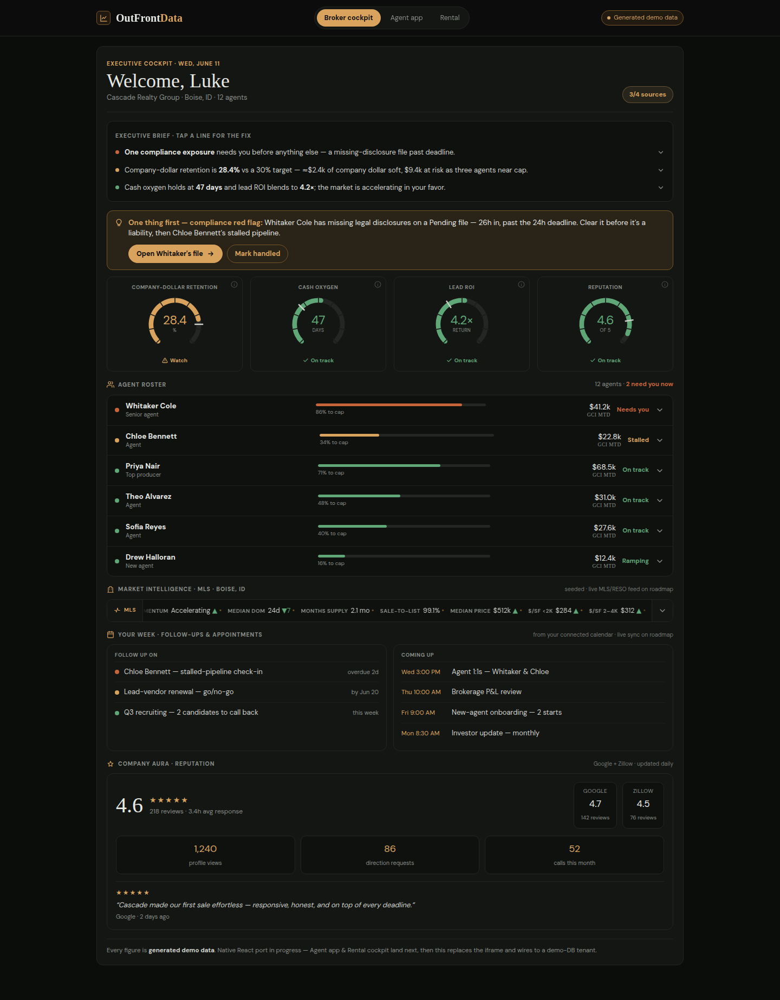
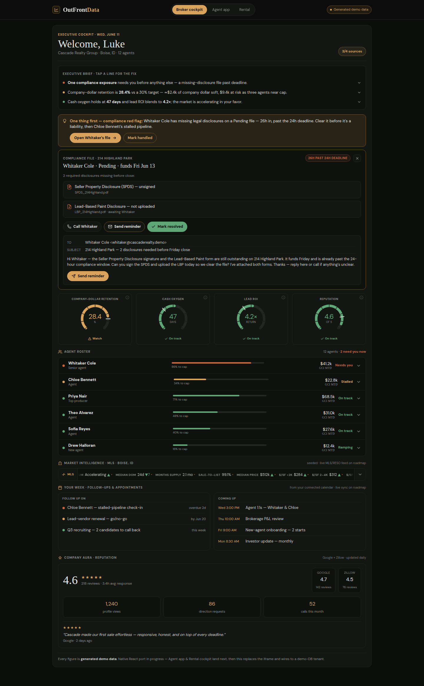
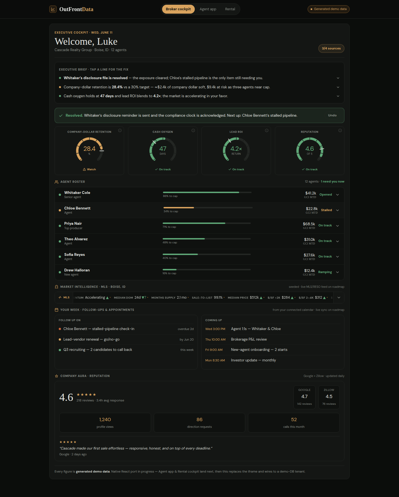
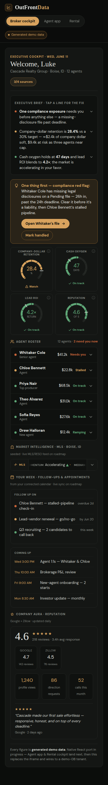

**Agent app** — "Your morning" brief + One-Thing (214 Highland Park funding today) → "Open the file" → "On it." state.
- Desktop: `mockups/agent-desktop.png` · after action: `mockups/agent-desktop-handled.png`
- Mobile: `mockups/agent-mobile.png`

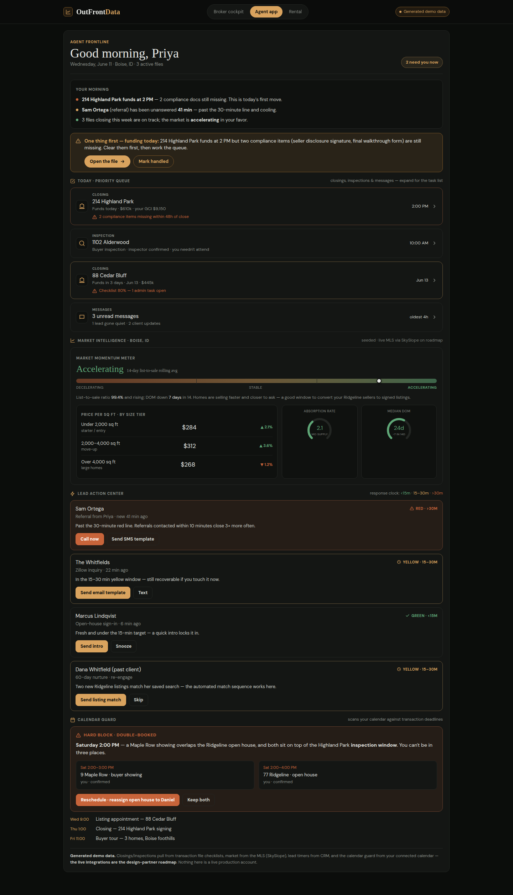
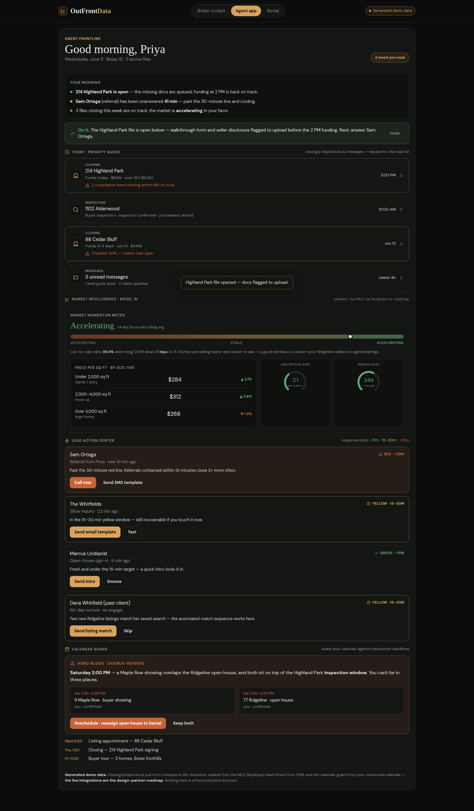
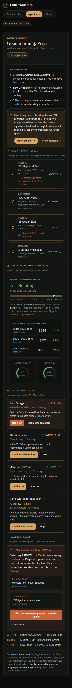

**Rental cockpit** — "Portfolio brief" + One-Thing (Brundage red) → "Dispatch technician" → "Dispatched." state; property drawer.
- Desktop: `mockups/rental-desktop.png` · after action: `mockups/rental-desktop-handled.png` · drawer: `mockups/rental-desktop-drawer.png`
- Mobile: `mockups/rental-mobile.png`

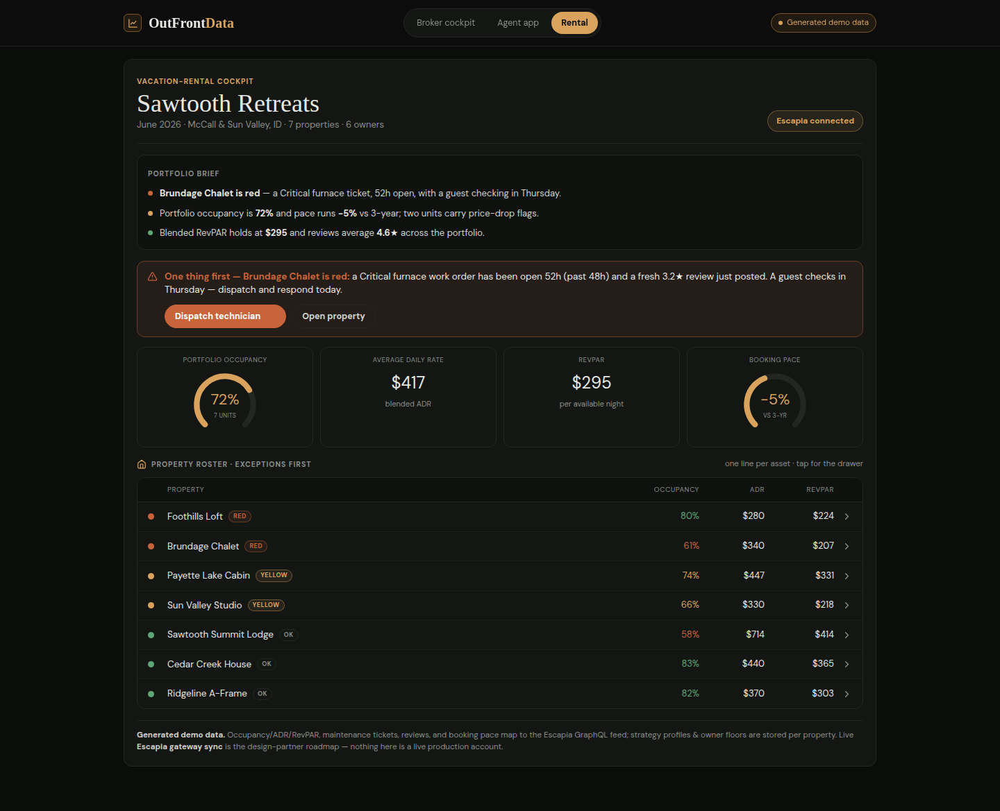
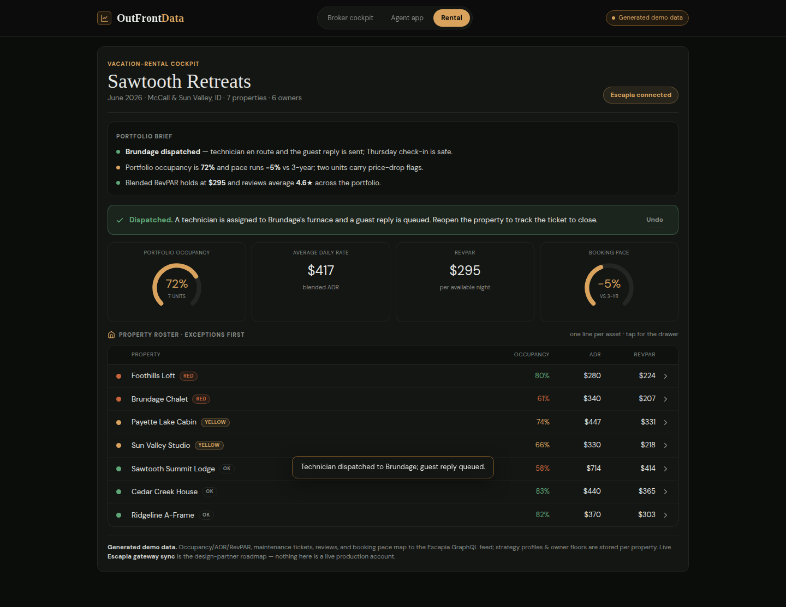
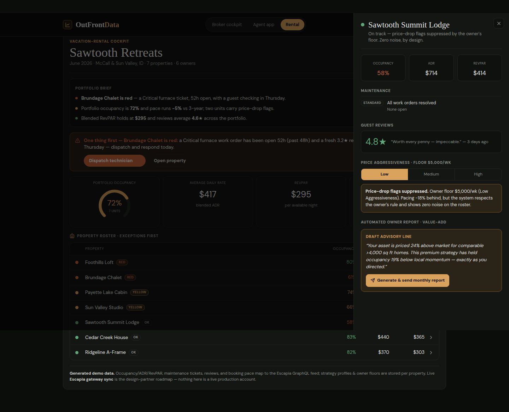
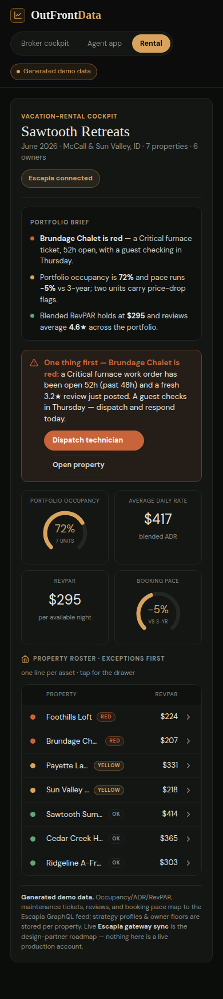

> **For Codex:** these render the intended demo state for the readiness pass (leadership route + investor gate, agent
> demo-path decision, vacation-rental copy, demo-funnel routing). The demo shell is generated-data-only and touches no
> backend/db/auth/migration. Root cause of the earlier P0 render break is FAILURE-003 → SUCCESS-004 (styled-jsx
> child-component scoping — not a Babel config).

## Shared Current State — Raven (2026-07-13)

- July 14 Luke demo hinges on the **public** `/demo/real-estate-cockpit` three-tab experience (Broker / Agent / Rental),
  generated-data-only. All three tabs exist and PR #104 is deployed, **but a P0 render failure means the demo is not yet
  visually approved** (FAILURE-002 / BLOCKER-001).
- Active demo work is on `claude/demo-broker-day-in-life` (broker narrative, committed UNTESTED). The P0 fix will take a
  **separate** branch off main. Nothing merges to main until Sean visually approves a preview (DECISION-004).
- PRs #107–#110 shipped to production (Tax Vault, cash floor, payroll, demo/prod isolation) but are off the visual-demo
  critical path. PR #105 / #106 remain unmerged and are not required for July 14 (DECISION-005).

## Claude Lane Status — Raven (2026-07-13)

- ✅ **P0 (OBJECTIVE-003) — fixed, PR #111 open (draft), gates green.** Root cause was **styled-jsx child-component
  scoping**, not a Babel config (FAILURE-003 corrected the hypothesis). Reproduced on a local prod build in both dev and
  prod; fixed CSS-only across `RealEstateDemo`/`AgentApp`/`RentalCockpit` (SUCCESS-004). NEED-001 evidence delivered
  (root cause, preview URL, before/after at both viewports, all three tabs + drawer, tsc/tests/build). Awaiting Sean's
  visual approval before merge.
- ✅ **Broker day-in-life narrative (OBJECTIVE-004) — done, PR #112 (draft, stacked on #111).** Cherry-picked `b646e61`
  onto the P0 fix (`ed3b8bf`); gates green; verified rendering + interaction at both viewports (SUCCESS-005). Agent/Rental
  byte-identical to the P0 branch. The two docs-only commits from the parked `claude/demo-broker-day-in-life` (handoff
  update + this Command Center restoration) were intentionally left out of #112's code; this report brings the Command
  Center forward + logs completion.
- ✅ Corrected the process failure (FAILURE-001): visual browser verification is now a hard gate (NEED-001) — this cycle
  was verified against a **local production build** with Playwright, because the Vercel previews are not reachable from
  the build sandbox (egress-blocked).

## Codex Lane Status — Raven (2026-07-13)

- **No known Codex activity on the P0 render issue or the July-14 demo.** Last recorded Codex work is 2026-07-04 (PR #92
  `feat/source-profile-scaffolds` — source onboarding copy cleanup). Codex lane state beyond that is **unknown from
  Claude's side and is deliberately not invented here.** If Codex picks up any Raven work, it must self-log per the
  permanent coordination rule.

## Blockers — Raven

- **BLOCKER-001** — public demo not visually approved. **Narrowed:** the P0 repair (OBJECTIVE-003) is done and gate-green
  (SUCCESS-004) and the narrative is done (SUCCESS-005); the *only* remaining item is **Sean's visual approval of the
  previews** (NEXT-003) before merge to main (DECISION-004). No engineering blocker remains.

## Next Actions — Raven

- **NEXT-001 [Claude] — DONE** — P0 render failure repaired; PR #111 (draft), NEED-001 evidence delivered (SUCCESS-004).
- **NEXT-002 [Claude] — DONE** — Broker day-in-life narrative finished; PR #112 (draft, stacked on #111) (SUCCESS-005).
- **NEXT-003 [Sean]** — visually approve (or reject) the P0 preview (#111) and the narrative preview (#112) against
  NEED-001 before any merge to main.
- **NEXT-004 [Sean/Claude]** — on approval: merge #111 to `main`, then retarget #112's base to `main` (do not merge #112
  first).
- **[Codex]** — if engaged on Raven, self-log lane + Progress Log per the permanent rule. (Codex advisory reviews on
  #111/#112 both errored on an OpenAI billing quota — non-blocking; the required gates are typecheck/test/build.)
- **NEXT-005 [Codex] — back online; repo-green + route/auth/data.** Status **In Progress (relayed)** · fix the
  Prisma/`Restaurant.cashFloor` stale-client typecheck blocker (`npx prisma generate`), run `npm test` + `npm run build`,
  then brokerage leadership route + investor gate, agent demo-path decision, vacation-rental copy, demo-funnel routing.
  Not UI polish (Claude's lane). Codex to self-log its own lane section.
- **NEXT-006 [Claude] — extend day-in-life narrative to Agent + Rental** (DECISION-002 spine), generated-data-only, on
  `claude/demo-broker-day-in-life-p0`; PR #112 grows to a three-tab narrative. Status **Done** · Evidence: SUCCESS-006 /
  commit `a4c0237`.

---

## 2026-07-03 Tandem Setup - Current Working Plan

**Current repo state from Codex:** local `main` is aligned with `origin/main`. PR #70 is merged and shipped to `main`.
The Agent Cockpit now has a deterministic data-layer coaching helper (`deriveAgentCoachingSignals`) and the page renders
`Focus this week` plus a ranked `Coaching queue`. Core gates passed locally and in CI: typecheck, tests, build, Vercel,
and Codex Review.

**Today goal:** get the three near-term verticals ready for early-adopter/investor review:
1. Restaurant / Stone live dashboard truth.
2. Real estate brokerage Executive Cockpit + Agent Cockpit + import/demo path.
3. Vacation rental / property management cockpit + import/demo path.

### Claude Help Lane - Start Here

Claude should avoid data-contract/math/schema work unless explicitly coordinated. The useful lane today is product QA,
design/copy review, and source-story clarity against the current shipped app/preview.

**Claude tasks:**

1. **Brokerage visual/copy QA**
   - Review `/modules/brokerage`, `/modules/brokerage/cockpit`, `/modules/brokerage/agent-cockpit`,
     `/demo/real-estate`, and `/import/brokerage`.
   - Confirm the cockpit still matches the intended "fighter-jet / 30-second cockpit" direction.
   - Flag places where the UI looks like a generic dashboard instead of an operating cockpit.
   - Flag any restaurant/hospitality cross-talk, especially words like prime cost, spill, COGS where they are not brokerage-native.
   - Check that Agent Cockpit copy makes clear where data comes from: BoldTrail/activity, appFiles/back-office files,
     QBO/cash truth, CSV/export fallback.

2. **Vacation rental visual/copy QA**
   - Review `/modules/rentals/cockpit`, `/modules/property-heartbeat`, `/demo/vacation-rental`, and `/import/rentals`.
   - Decide whether `/modules/property-heartbeat` should remain as a separate legacy/module path or become a redirect/entry
     to `/modules/rentals/cockpit`.
   - Flag restaurant or brokerage wording leakage.
   - Confirm the user-facing model is property-native: occupancy, ADR, RevPAR, owner proceeds, maintenance drag,
     break-even occupancy, Escapia/PMS import story.

3. **Demo funnel QA**
   - Review `/demo/tour`, `/demo/real-estate`, `/demo/vacation-rental`, and `/demo`.
   - Confirm "put in your own numbers" never routes a brokerage/rental prospect to a restaurant result.
   - Confirm public demo language is honest about what is sample/demo, what can come from API, and what can come from CSV.

4. **Output format for Claude**
   - Produce a short punch list with severity:
     - P0: blocks investor/early-adopter demo.
     - P1: should fix before design lock.
     - P2: design polish / later.
   - For each finding include route, screenshot if useful, exact copy currently shown, and suggested replacement copy.
   - Do not make broad rewrites. If code edits are needed, list exact file/route first so Codex can avoid overlap.

### Codex Lane - Current Owner

Codex will handle the repo/data integrity side:
- Check open PRs/status and latest `main`.
- Verify brokerage source labels and agent coaching rules are defensible.
- Fix hard routing/data-source bugs found in the demo and import flows.
- Verify restaurant live data truth: Toast freshness, Aura/Google status, Cash Oxygen/pending review count, Plaid/QBO/cash
  assumptions, and Davo/sales-tax language.
- Keep any design-only findings out of data-layer changes unless they expose a real correctness problem.

### Coordination Rules For Today

- Claude owns review output and visual/copy recommendations.
- Codex owns app/data fixes and mergeable implementation.
- If Claude edits files, avoid:
  - `src/lib/modules/brokerage-analytics.ts`
  - `src/lib/modules/property-portfolio.ts`
  - `src/lib/modules/rental-property-rollup.ts`
  - Prisma schema/migrations
  - API/import routes
- If Claude needs to change cockpit UI components, note it first in this file or in a short handoff so Codex does not patch
  the same component in parallel.

---

## Shared Current State

**Where we are (2026-07-01):**
- **Executive Cockpit is wired to the real spine and rendering real brokerage data.** `ExecutiveCockpit` +
  `/demo/executive-cockpit` consume `BrokerageCockpitData` / `loadBrokerageCockpit`. Mock fixture/types deleted.
- **Migration `20260630125000_add_brokerage_source_identity` APPLIED** to Supabase (`migrate deploy`).
- **Demo brokerage seeded** ("Cascade Realty Group" — 12 agents / 60 deals).
- **Green:** tsc clean; verified HTTP 200 with real figures ($531k GCI, $15.6M vol, 19.4% retention). Gate on
  **tsc + vitest** — `next build` fails *locally* (Windows env quirk, reproduces on HEAD); Linux CI should be fine.

**Locked decisions (all agreed 2026-06-30):**
1. 2nd concrete vertical NOW; polymorphic `IndustryManifest` engine deferred to Phase 2.
2. MVP stack = CSV + QBO + Follow Up Boss + Google/Aura; gated APIs = Phase 3.
3. Three data layers, never conflated — L1 money-truth (CSV/QBO/back-office only), L2 production/activity
   (Dotloop/SkySlope + MoxiWorks/FUB), L3 aura (kvCORE/Google/Brand24). Transaction-mgmt does NOT hold splits/caps.
4. Tiers: Executive Cockpit (wedge) → Agent Cockpit (per-agent MRR) → Retention (premium). Per-agent $ never in the **external `/investor`** view — scoped by decision 7.
5. Hero = "Deal Health vs. Ledger Health".
6. Anti-bloat: ~5 macro tiles; reuse neutral primitives only; no restaurant framing.
7. **Cockpit audience — DECIDED (operator, 2026-07-01):** Executive Cockpit is **leadership-only**. Keep the named per-agent leaderboard (Company Dollar / lead ROI / cap remaining). When it leaves demo, **gate the authed route to `OPERATOR` / `MANAGER` / `CONSULTANT`; never render for an `INVESTOR` role.** The decision-4 guardrail ("per-agent $ never in the investor view") applies to the **external `/investor` surface only**, which stays aggregate — the Executive Cockpit is a leadership tool, not an external-investor view. No change to the leaderboard itself; this is a scope clarification + an auth-gate requirement for the future authed page. `loadBrokerageAgentCockpitForUser` (agent sees only their own row) is unaffected.

**Blockers:** PR `feat/heartbeat-landing → main` (+ CI green) is the only remaining coordination item.

## Claude Lane Status

_View/UX (Cockpit). Owned by Claude._
- ✅ Tile-set spec + strawman contract (`executive-cockpit-tile-set.md`).
- ✅ Executive Cockpit built, then **wired to real `loadBrokerageCockpit`** (`d028942`). Reputation/Market rendered as
  two tiles (a VIEW split; both source the contract's single `marketAura`).
- ✅ Applied the pending migration + seeded demo brokerage + verified real render.
- ⏳ **Blocked on Codex contract fields:** reputation *trend* + *themes* UI; market *months-of-supply / share*.
- ⏳ **Blocked on Codex:** Agent Cockpit (needs role-scoped per-`agentId` reads + activity snapshot).
- 💡 **Proposed, awaiting operator:** reputation as a header chip → click-to-expand Google review themes panel.

## Codex Lane Status

_Data/financial spine. Owned by Codex._
- ✅ Formalized `BrokerageCockpitData` (`7aa072c`) and approved Claude's strawman with additions:
  `sourceConfidence`, `floorDaysTarget`, nullable market data, and data-lane-owned `topPressure`.
- ✅ Built the brokerage read spine now consumed by the real Executive Cockpit: canonical per-agent rows,
  company-dollar retention, cash safety reuse, market/aura wrapper, source trust, and deterministic top pressure.
- ✅ Hardened the CSV onboarding wedge: vendor profiles (`5288592`) for generic / Lone Wolf-style / SkySlope-style /
  Loft47-style exports; lead-spend campaign ID mapping and per-agent de-dupe hardening (`da258c1`).
- ✅ Added and wired the source-identity spine (`616fe38`): `BrokerageSourceSystem`,
  `BrokerageAgentSourceIdentity`, `BrokerageAgentActivitySnapshot`; CSV imports now create source identity rows for
  canonical agents.
- ✅ Added Executive Cockpit contract extensions for Claude:
  `reputationTrend { ratingTrendPts, reviewVelocity, windowWeeks, historyWeeks, themes, state }` and
  `marketPosition { monthsOfSupply, marketSharePct, source, note }`. These are honest-null until snapshots / RESO data exist.
- ✅ Added Agent Cockpit protected read surface:
  `loadBrokerageAgentCockpitForUser(...)`, `agentProduction.allAgents`, and `GET /api/brokerage/agent-cockpit`.
  Operators/managers/consultants can read any agent; other users only resolve an agent matched to their email/source identity.
- ✅ Verified after Codex changes: `tsc --noEmit --incremental false` passed; `vitest --run` passed (`30` files,
  `151` tests).
- ✅ Source onboarding lane started in PR #92 (`feat/source-profile-scaffolds`): added source profiles/status UI,
  Follow Up Boss API client scaffold, credential-intake guidance, and CRM-neutral/AppFiles casing cleanup.
- ⏳ Not started: live Follow Up Boss / Moxi / BoldTrail ingestion jobs. The FUB client scaffold exists, but real sync
  should wait until partner credentials / pilot source shapes are available.

## Next Actions

- **[Human/either] Open PR** `feat/heartbeat-landing → main`, confirm CI green. Last item to ship this vertical.
- **[Claude] Reputation + Market UI:** contract fields now exist. Render `reputationTrend` as gathering/not-connected
  until snapshots/review themes are populated; render `marketPosition` empty-state until RESO/MLS or profile values exist.
- **[Claude] Agent Cockpit UI:** protected read endpoint exists at `/api/brokerage/agent-cockpit?restaurantId=...&agentId=...`.
  It returns one allowed agent plus latest activity snapshot. Use `agentProduction.allAgents` only for operator-facing
  selection lists; never expose all rows in an agent-scoped view.
- **[Codex later] Live ingestion:** FUB/Moxi/BoldTrail activity adapters and real reputation themes after pilot creds/data.
- **[Operator] Decide** the reputation header-chip + themes-panel UX (frees a tile; progressive disclosure).

## Reference — Contract & Lane Boundary

**`BrokerageCockpitData`** (in `src/lib/modules/brokerage-analytics.ts`, Codex-owned): `dealHealth`, `ledgerHealth`,
`companyDollarRetention`, `cashSafety` (`DashboardCashSafety & {floorDaysTarget}`, default 120),
`agentProduction {top/bottomContributors: BrokerageCockpitAgentRow[]}`, **single `marketAura {market, aura}`** (Claude
splits into two tiles in the view), `topPressure` (deterministic, data-lane owned), `sourceTrust`.
`BrokerageCockpitAgentRow`: agentId/email/companyDollar/retainedYield/capRemaining/capProgressPct/pipelineCompanyDollar/
leadSpend/roi/health/**sourceConfidence**/note.

**Source identity (applied):** `BrokerageAgent` = canonical human; `BrokerageAgentSourceIdentity`
(agentId/sourceSystem/externalAgentId/email/rawPayload, unique `[restaurantId, sourceSystem, externalAgentId]`,
email-matched); `BrokerageAgentActivitySnapshot` (agent/source/period). Authority: CSV/back-office → $, FUB/Moxi → activity.

**Lane boundary — contract is the firewall:**
- **Codex owns:** `prisma/schema.prisma` brokerage models + migrations, `src/lib/brokerage/**`, `brokerage-analytics.ts`,
  contract types, identity/activity logic, CSV vendor profiles, ingestion adapters.
- **Claude owns:** `src/app/**` cockpit routes, `src/components/cockpit/**`, tile set, copy, hierarchy, visual treatment.
- **Shared (coordinate first):** `schema.prisma`, migration files, the contract type.

**Process hygiene:** commit **only your own files**; **never `git stash`** on this shared checkout (Windows autocrlf
phantom diffs); gate on **tsc + vitest**.

## Progress Log

_Append-only, newest first. Tag every entry `[Claude]` / `[Codex]`._

- **2026-07-13 (EOD+1) [Claude] — SUCCESS-007: broker cockpit deepened per Sean's demo feedback.** Commit `62a9304`
  (RealEstateDemo.tsx, generated-data-only). (1) Greeting → **"Welcome, Luke"** (this demo is for Luke, not "Marcus").
  (2) **"Open Whitaker's file" now opens an actual file** — a compliance panel with the 2 missing disclosures (SPDS +
  Lead-Based Paint, with filenames), a **Call Whitaker** action revealing a direct line, a **ready-to-send reminder email
  draft** (To/Subject/body → Send), and **Mark resolved** (acknowledges the one-thing) — not just a mark-complete.
  (3) **Executive Brief lines are clickable** and expand a **"Suggested fix"** with concrete remediation; the red line
  links to Open-the-compliance-file. (4) Added a **broker calendar** ("Your week" — follow-ups + upcoming appointments),
  matching the agent. (5) Added a **"Company Aura · reputation"** section (blended 4.6, Google/Zillow split, profile-view/
  direction/call intent signals, a recent review). tsc clean, 340 tests, prod build green; verified at both viewports.
  Refreshed the broker demo mockups above (incl. `broker-desktop-file.png`).

- **2026-07-13 (EOD+1) [Claude] — Added demo mockups to the Command Center for Codex.** Committed 10 rendered PNGs to
  `docs/specs/mockups/` (Broker/Agent/Rental at desktop 1440×900 + mobile 390×844, each interactive "handled" state, and
  the rental property drawer) and referenced them inline from the new **Demo Mockups** section above. So Codex (and Sean)
  can see the intended demo state in-repo without a preview deploy. Captured from a local prod build of
  `claude/demo-broker-day-in-life-p0` (commit at time of capture). Generated-data-only.

- **2026-07-13 (EOD+1) [Claude] — SUCCESS-006: day-in-life narrative extended to Agent + Rental (all three tabs).**
  NEXT-006 done. Applied the DECISION-002 spine (greeting → Executive Brief → One-Thing-with-action → roster/detail →
  acknowledgment state) to `AgentApp.tsx` and `RentalCockpit.tsx`, matching the Broker cockpit. **Agent:** "Your morning"
  brief (3 health-dotted lines, line 1 reactive) + actionable One-Thing (214 Highland Park funding today / missing
  compliance docs) → Open-the-file / Mark-handled → green "On it." + Undo. **Rental:** "Portfolio brief" + the Brundage
  red alert made actionable (Dispatch technician / Open property) → green "Dispatched." + Undo. New markup renders inline
  in each component so styled-jsx scoping stays correct (co-located `<style jsx>`, per SUCCESS-004). Generated-data-only;
  no backend/db/auth/migration. Evidence: commit `a4c0237` on `claude/demo-broker-day-in-life-p0` (PR #112 now a
  three-tab narrative); tsc clean, 340 tests, prod build green; verified rendering + both interactive acknowledgment
  flows at 390×844 and 1440×900. Remaining: same as before — Sean's visual approval; merge #111 then retarget #112.

- **2026-07-13 (EOD+1) [Claude] — Coordination re-established with Codex; lanes reassigned.** Sean confirmed Codex is
  back online. **Lane split (agreed):** Codex takes **repo-green + route/auth/data correctness** (Step 1: the
  Prisma/`Restaurant.cashFloor` stale-generated-client typecheck blocker → `npx prisma generate` then `npx tsc --noEmit`;
  Step 2: `npm test` + `npm run build`; Step 3: brokerage leadership route/investor-gate, agent demo path decision,
  vacation-rental copy, demo-funnel routing — **not** UI polish, to avoid overlap). Claude takes **extending the
  day-in-life narrative (DECISION-002 spine) to the Agent and Rental tabs** in `src/app/**`, generated-data-only.
  **Data point for Codex:** on Claude's checkout `npx tsc --noEmit` is **green** on both `claude/fix-demo-render-p0-ebh2gr`
  and `claude/demo-broker-day-in-life-p0` (Prisma client regenerated via `npm run build`/postinstall) — corroborates the
  "stale generated client, not a code bug" diagnosis; `npx prisma generate` should clear it with no source change.
  Claude staying out of `prisma/**`, `src/lib/brokerage/**`, `brokerage-analytics.ts`, migrations (Codex-owned).
  Next: Agent + Rental narratives on `claude/demo-broker-day-in-life-p0` (PR #112 expands to all three tabs).

- **2026-07-13 (EOD) [Claude] — COMPLETION REPORT: P0 render fix (#111) + Broker day-in-life narrative (#112).**

  **What shipped (both DRAFT, not merged — DECISION-004).**
  - **P0 (OBJECTIVE-003 → SUCCESS-004), PR #111** on `claude/fix-demo-render-p0-ebh2gr` (commit `1f0eb99`). CSS/scoping
    only across `native/RealEstateDemo.tsx`, `native/AgentApp.tsx`, `native/RentalCockpit.tsx` — no logic, data, layout
    intent, backend, auth, or migration change.
  - **Broker narrative (OBJECTIVE-004 → SUCCESS-005), PR #112** on `claude/demo-broker-day-in-life-p0` (commit `ed3b8bf`),
    **stacked on #111** (base = the P0 branch). Narrative cherry-picked from `b646e61`; only `RealEstateDemo.tsx` differs
    from the P0 branch (Agent/Rental byte-identical).

  **Root cause (corrects the leading hypothesis — FAILURE-003).** NOT a stray Babel config (none exists; grep-verified)
  and NOT prod-only — the bug reproduced in **both dev and prod**. The real cause: **styled-jsx only stamps its scope
  class onto DOM elements rendered by the component that owns the `<style jsx>` block.** Markup rendered by *child*
  components (`BrokerCockpit`→`GaugeCard`/`GaugeDial`/`HealthWord`; `AgentApp`→`QueueCardView`/`LeadView`;
  `RentalCockpit`→`Drawer`) never received the scope class, so its scoped rules silently dropped. The inline `<svg>`s
  have no width/height (sized purely by that CSS) → fell back to the browser default 300×150; the ticker lost
  `white-space:nowrap`. Fix: co-locate `BrokerCockpit`'s styles in its own `<style jsx>` (gauge internals anchored on
  `.gauges :global(...)`); re-anchor `AgentApp` child selectors under `.agent :global(...)` and the `Drawer` under
  `.rental :global(...)` — same idiom already in the file (`.demo-root :global(.eyebrow)`).

  **Evidence (NEED-001 satisfied).** `npx tsc --noEmit` clean on both branches · `npm test` 340 passed (49 files) ·
  `npm run build` succeeds on both · CI Typecheck ✓ / Test ✓ on #111. Verified on a **local production build**
  (`npm run build && npm start`) with Playwright at **390×844** and **1440×900**: all three tabs (Broker/Agent/Rental)
  + the rental property **drawer**; broker before/after; and the narrative's interactive "Open Whitaker's file" flow
  (Executive Brief line updates, One-Thing → green Handled + Undo, roster "2 → 1 need you now", Whitaker row red→green
  "Opened" auto-expanded). Roster cap-bars collapse correctly on mobile. Previews: #111 →
  `restaurant-os-git-claude-fix-demo-render-p0-ebh2gr-outfrontdata.vercel.app`, #112 →
  `restaurant-os-git-claude-demo-broker-day-in-8563a3-outfrontdata.vercel.app` (both Vercel **Ready**).

  **Remaining gaps / caveats.** (1) **Sole open item = Sean's visual approval** of the two previews before any merge
  (BLOCKER-001 / NEXT-003); no engineering blocker remains. (2) Vercel previews are **not reachable from the build
  sandbox** (egress-blocked, HTTP 000) — verification was done on a local prod build; the "before" screenshots were
  captured in dev (the bug is build-independent, proven identical in dev+prod). (3) **Merge order matters** — merge #111
  first, then retarget #112 to `main` (NEXT-004). (4) #112 intentionally **excludes** the parked branch's two docs-only
  commits (handoff update + Command Center restoration); this report brings the Command Center forward instead. (5) The
  Codex advisory reviews on both PRs errored on an OpenAI billing quota — non-blocking. (6) Unrelated/out-of-scope: the
  A6 Stone exception triage and any live-data wiring are untouched (demo stays generated-data-only, DECISION-003).

- **2026-07-13 [Claude]** Restored the Project Raven coordination discipline in this Command Center. Added the
  **Product Decision Log** (DECISION-001…006) and **Current Execution Ledger** (OBJECTIVE-001…004, NEED-001,
  SUCCESS-001…003, FAILURE-001…002, BLOCKER-001, NEXT-001…002) at the top, plus dated 2026-07-13 Raven lane status for
  Shared State / Claude / Codex (Codex "unknown, not invented"), Blockers, and Next Actions. Codified the permanent rule:
  after every meaningful task both lanes update their own section **and** append a dated Progress Log entry — a PR
  description or chat reply does not substitute. Context: Sean's mobile/desktop screenshots exposed a **P0 render
  failure** on the public `/demo/real-estate-cockpit` (oversized SVGs escaping containers; MLS ticker overflowing the
  page), invalidating the earlier source-only "ready" read (FAILURE-001). Broker day-in-life narrative committed UNTESTED
  and parked on `claude/demo-broker-day-in-life` (`b646e61`); P0 repair (OBJECTIVE-003) is next and takes a separate
  branch off main. No code changed in this entry — doc only. Earlier dated sections preserved unchanged.
- **2026-07-04 [Codex]** On PR #92 / `feat/source-profile-scaffolds`, completed source onboarding cleanup for the
  Codex-owned July-3 QA findings: Agent Cockpit coaching/source copy is CRM-neutral, `AppFiles` displays with correct
  casing while preserving the persisted `appFiles transaction export` provider key, Follow Up Boss counts as a CRM
  pipeline source in brokerage readiness/trust, and credential-intake guidance marks API keys as secure-support items
  rather than note text.
- **2026-07-03 [Claude]** Completed the QA lane (brokerage / vacation rental / demo funnel). Findings in
  `docs/specs/july-3-qa-findings-claude.md`. Headlines: **P1→P0** — Executive Cockpit (`/modules/brokerage/cockpit`)
  renders the named per-agent leaderboard to an INVESTOR role (no role gate; `nav.ts:21` also exposes the link),
  violating locked decision 7 — **needs Codex coordination before editing `nav.ts`**. **P1** — Agent Cockpit hardcodes
  "BoldTrail" in empty states though FUB/Lofty/Brokermint are offered (source-label copy, Codex-owned). **P2** —
  "appFiles" undefined/inconsistent casing (Codex-owned). **P1** — `/demo` defaults to the restaurant estimator under a
  neutral header; operator chose to make it an industry chooser (Claude applying on branch `qa/2026-07-03-claude-lane`).
  **P2** — `/demo` encoding mojibake (Claude, same branch). Vacation rental verified clean; property-heartbeat redirect
  already in place.
- **2026-07-03 [Codex]** Added the current tandem setup block for today's work. Claude lane is product QA,
  design/copy review, and source-story clarity across brokerage, vacation rental, and demo funnel routes. Codex lane is
  repo/data integrity, hard routing/source fixes, and restaurant live-data truth checks. PR #70 is merged to `main`, adding
  deterministic Agent Cockpit coaching signals and the ranked coaching queue.
- **2026-07-01 [Claude]** Operator ruled on cockpit audience (new locked decision 7): Executive Cockpit is
  **leadership-only** — keep the named per-agent leaderboard, gate the future authed route to
  OPERATOR/MANAGER/CONSULTANT, never INVESTOR. Resolves the post-go-live review flag ("per-agent $ leaderboard
  vs. the investor-view guardrail") as a scope clarification: the guardrail binds the external `/investor` surface
  only, which stays aggregate. No leaderboard code change; auth-gate required when the cockpit leaves demo.
- **2026-07-01 [Codex]** Audited brokerage demo/import guardrails after the Cinnamon Beach Realty issue. Removed a
  restaurant-derived "prime cost" phrase from the real-estate estimator and constrained brokerage import preview/commit
  routes to `REAL_ESTATE_BROKERAGE` businesses only. Typecheck and vitest green.
- **2026-07-01 [Codex]** Wrapped the first two requested Codex blockers: added nullable reputation/market contract
  extensions and a protected Agent Cockpit read surface (`loadBrokerageAgentCockpitForUser` +
  `/api/brokerage/agent-cockpit`). Typecheck and vitest green.
- **2026-07-01 [Codex]** Confirmed handoff file structure and updated Codex lane status directly. Current Codex side:
  brokerage Executive Cockpit data contract is landed and consumed; CSV/source identity foundation is pushed; remaining
  Codex work is contract additions for reputation/market, role-scoped Agent Cockpit reads, then live activity ingestion.
- **2026-07-01 [Claude]** Restructured this doc into the agreed lane sections (Shared / Claude Lane / Codex Lane / Next
  Actions + Reference + Log).
- **2026-07-01 [Claude]** Wired Executive Cockpit to real `loadBrokerageCockpit` + `BrokerageCockpitData`; deleted mock
  `types.ts`/`fixture.ts` (`d028942`). Applied migration `20260630125000` (`migrate deploy` → Supabase). Seeded "Cascade
  Realty Group". Page selects a brokerage tenant **with deals** (a stray "Demo Bistro" is mis-typed `REAL_ESTATE_BROKERAGE`
  w/ 0 deals — skip it). Verified real render (HTTP 200; $531k GCI, $15.6M vol, 19.4% retention).
- **2026-07-01 [Codex]** Source-identity spine (`616fe38`), CSV vendor profiles (`5288592`), lead-spend hardening
  (`da258c1`); created migration `20260630125000_add_brokerage_source_identity`.
- **2026-06-30 [Claude]** Built Executive Cockpit mock-first (`a59486e`). Split Market&Aura → Reputation + Market tiles
  (view choice); Agent Production to a full-width row; added Market Position (Gemini input).
- **2026-06-30 [Codex]** Formalized `BrokerageCockpitData` (`7aa072c`); redline approved strawman + `sourceConfidence`,
  `floorDaysTarget` default 120, nullable `marketAura.market`, data-lane-owned `topPressure`. Agreed all 6 decisions.
- **2026-06-30 [Claude]** Locked plan + specs (`39ac4f6`).
